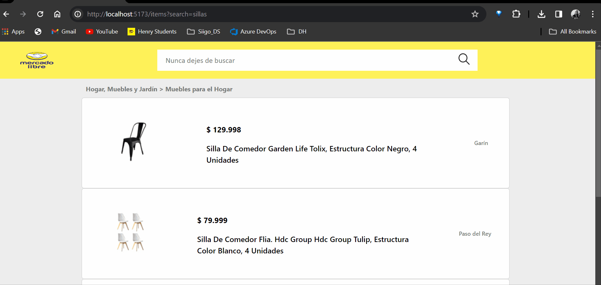

# Prueba-frontend-MELI Maria Elisa Hernandez

Este repositorio contiene un proyecto de desarrollo frontend generado con React 18 y Vite, utilizando SCSS y TypeScript. Además, se integra con la API de Mercado Libre a través de una un middleware creado en Node.js versión 20.10.0 y Express.

## DEMO

## Estructura del Repositorio

El repositorio está organizado en dos carpetas principales:

- **Cliente**: Contiene el código del frontend desarrollado en React 18, Vite, SCSS y TypeScript.
- **API**: Incluye el middleware desarrollado en Node.js y Express para consumir la API de Mercado Libre.

## Instrucciones de Inicio

### Frontend (Cliente)

Para iniciar el proyecto del frontend, sigue estos pasos:

    npm i
    npm run dev
    
    Se habilita en el puerto: http://localhost:5173/

### Backend (API)

Para iniciar el middleware del backend, realiza lo siguiente:

    npm i
    npm start
    
    Se habilita en el puerto: http://localhost:5000

## Detalles

- **Ruteo**: El proyecto está estructurado con rutas para la navegación dentro del cliente.
    - Ruta del buscador: http://localhost:5173/
    - Ruta busqueda de productos: http://localhost:5173/items?search=sillas
    - Ruta detalle del producto: http://localhost:5173/items/MLA1469431128
    
- **Tipado y Estilos**: Se ha implementado tipado utilizando TypeScript y estilos mediante SCSS para una mejor organización y mantenibilidad del código.

Si tienes alguna pregunta o problema con el proyecto, no dudes en contactarme.
    

